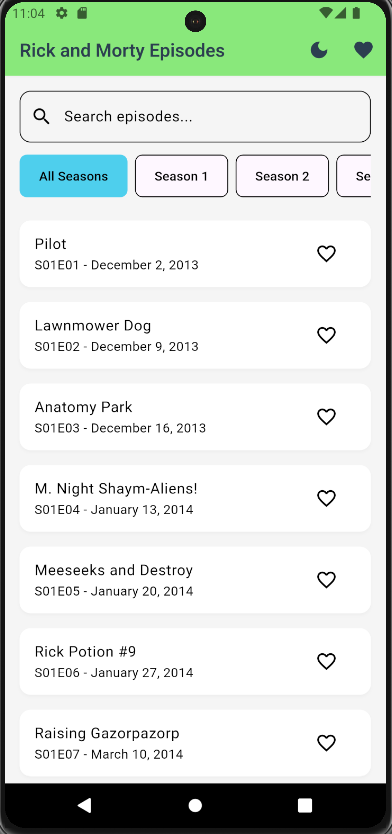
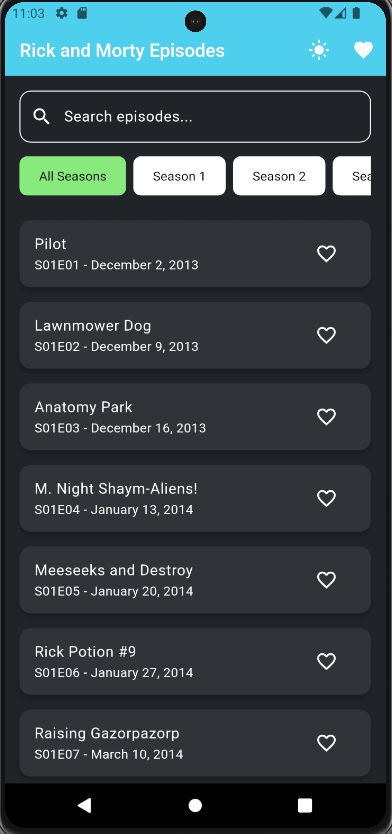
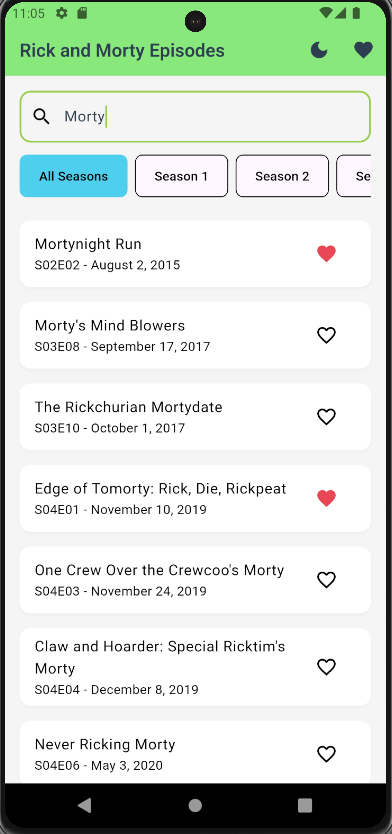
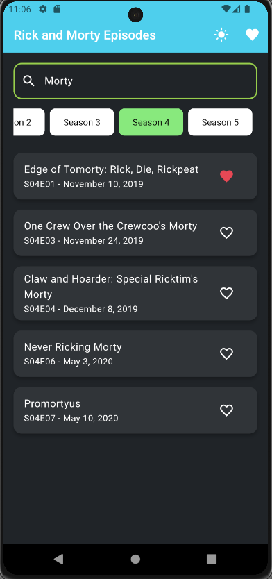
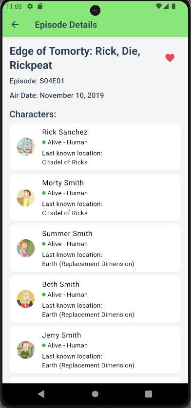
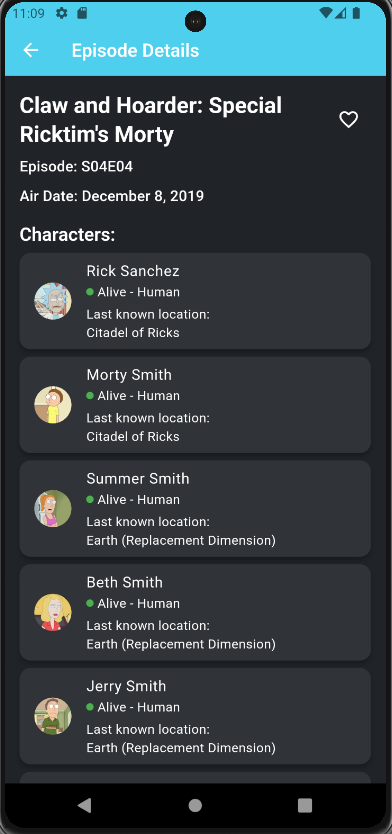
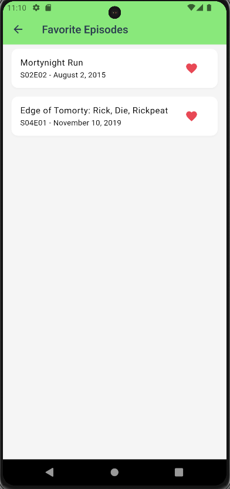
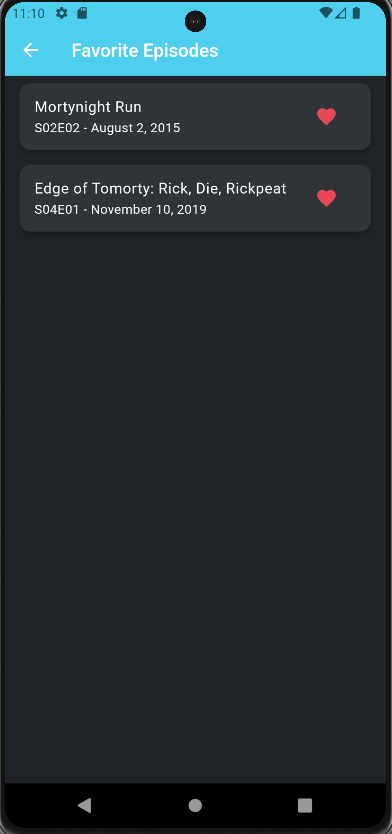

# Rick and Morty Explorer 🌀

Um aplicativo Flutter que explora o universo de Rick and Morty, permitindo visualizar episódios, personagens e gerenciar favoritos.

<details>
<summary><h2>1. 🚀 Começando</h2></summary>

### 1.1 Pré-requisitos

Antes de começar, certifique-se de ter instalado:
1. [Flutter](https://flutter.dev/docs/get-started/install) (versão mais recente)
2. [Dart](https://dart.dev/get-dart)
3. [Git](https://git-scm.com/)
4. IDE ([VS Code](https://code.visualstudio.com/) ou [Android Studio](https://developer.android.com/studio))

### 1.2 Instalação

```bash
# Clone o repositório
git clone https://github.com/seu-usuario/rick_and_morty_explorer.git

# Entre no diretório
cd rick_and_morty_explorer

# Instale as dependências
flutter pub get

# Execute o app
flutter run
```
</details>

<details>
<summary><h2>2. 📦 Dependências</h2></summary>

Adicione ao seu `pubspec.yaml`:

```yaml
dependencies:
  flutter:
    sdk: flutter
  cupertino_icons: ^1.0.2
  dio: ^5.4.0
  flutter_bloc: ^8.1.3
  equatable: ^2.0.5
  get_it: ^7.6.4
  shared_preferences: ^2.2.2
  cached_network_image: ^3.3.0

dev_dependencies:
  flutter_test:
    sdk: flutter
  flutter_lints: ^2.0.0
```
</details>

<details>
<summary><h2>3. ✨ Funcionalidades</h2></summary>

### 3.1 📺 Lista de Episódios
1. Lista completa de episódios
2. Filtros por temporada
3. Busca por nome
4. Sistema de favoritos

### 3.2 🔍 Filtros Inteligentes
1. Filtro por temporada
2. Busca por nome
3. Combinação de filtros
4. Persistência durante navegação

### 3.3 ⭐ Sistema de Favoritos
1. Marcar/Desmarcar favoritos
2. Lista dedicada
3. Persistência local
4. Atualização em tempo real

### 3.4 🎨 Temas
1. Modo claro e escuro
2. Cores personalizadas
3. Transições suaves
4. Visual consistente
</details>

<details>
<summary><h2>4. 🏗️ Arquitetura</h2></summary>

O projeto segue Clean Architecture com a seguinte estrutura:

```
lib/
├── core/
│   ├── constants/   # Constantes da aplicação
│   ├── di/          # Injeção de dependência
│   ├── errors/      # Tratamento de erros
│   ├── network/     # Configuração de rede
│   └── theme/       # Configuração de temas
├── data/
│   ├── datasources/ # Fontes de dados
│   ├── models/      # Modelos de dados
│   └── repositories/# Implementação dos repositórios
├── domain/
│   ├── entities/    # Entidades de domínio
│   ├── repositories/# Contratos dos repositórios
│   └── usecases/    # Casos de uso
└── presentation/
    ├── blocs/       # Gerenciamento de estado
    ├── pages/       # Telas
    └── widgets/     # Componentes reutilizáveis
```

### 4.1 Padrões Utilizados
1. Repository Pattern
2. Dependency Injection
3. BLoC Pattern
</details>

<details>
<summary><h2>5. 📱 Screenshots</h2></summary>

### 5.1 Tela Principal
<div align="center">
  
  
</div>

### 5.2 Filtros e Busca
<div align="center">
  
  
</div>

### 5.3 Detalhes do Episódio
<div align="center">
  
  
</div>

### 5.4 Favoritos
<div align="center">
  
  
</div>

</details>

--